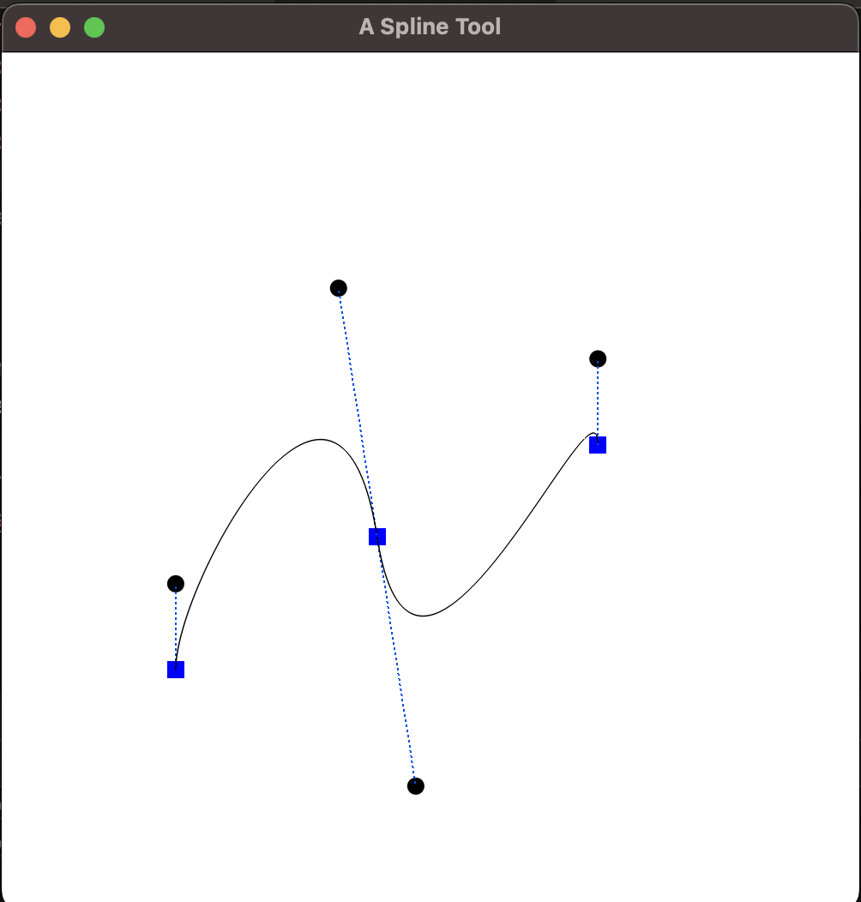
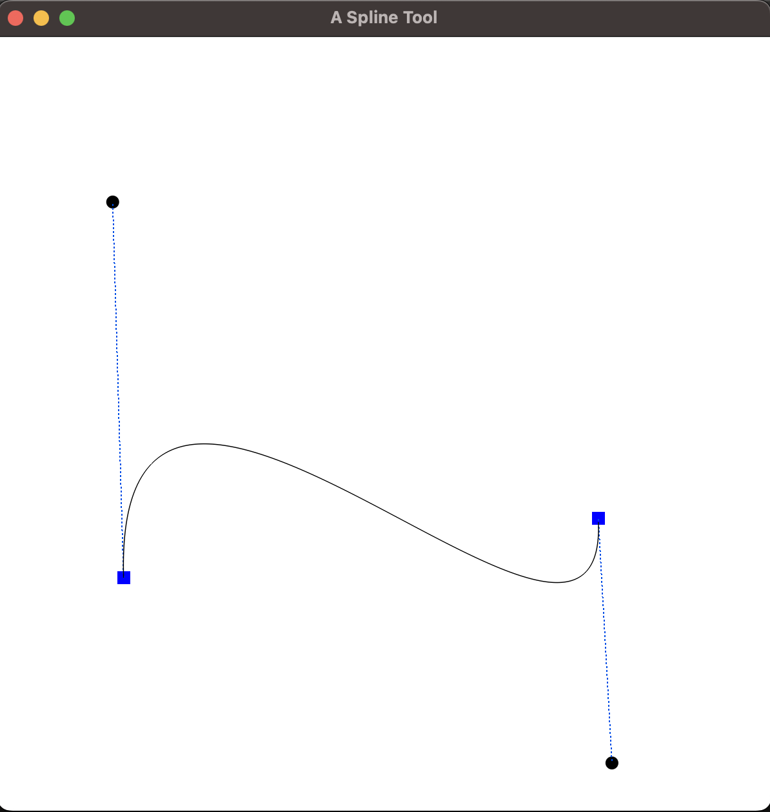

#                                                                               Spline-Tool

  
   
  <em>Spline Tool Example 1</em>

  
   
  <em>Spline Tool Example 2</em>

To run this program use commandline arguments, for example in the terminal of pycharm enter:
python3 SplineTool.py 700 700

The first argument after the file is the desired width of the screen size followed by the desired height.

This program creates a very basic spline tool where the user clicks anywhere on the screen and a node is created. Following each
subsequent click, a bezier curve is created with two control points for every curve created. The user can click and hold on
the nodes to drag them around or hold on the control points to adjust the curve.

The program is split into multiple parts with functions working concurrently to create the limited functionality spline tool.

The Node class helps to retrieve the node points and handle coordinates while also helping to manipulate the coordinates of
the handle if they are moved. The two handles are always at the opposite ends of each other which is why we can determine
the location of the other handle by multiplying the offset value of one handle. For example, initially handle 1 is stored as
(0,50), to plot this handle , we add the location of the node to this value to determine the exact location of the handle. By storing
our values like this, we can ensure that the handles will always maintain the same offset from the node.

render_node function loops through all of the list class objects and plots their associated points retrived by creating an
instance of that object and then accessing the node coordinates using ".point". Similarly, render_control_points follows the same logic
but the handles are accessed using ".handle1" and ".handle2" is handle 2 exists. The control point rendering function also calls
on a stipple() function which created the dotted lines between the node vertex and the handle vertices.

create_node function determines the current cursor position and creates a new node object with its associated values and then 
appends it into the nodes list. The second handle is also added if the node meets the eligibility criteria.

The mouse callback function helps to determine if the user is pressing the left mouse button or if they released it. If a user
presses the button and does not hold it , a new node is created at the cursor position. If the user is holding on that position and does not release
the button, the function then determines if the user is closer to the node, or one of the two handles. If the user's euclidean distance
is closer to the node, then the node object is called on and the point coordinates are replaced. Similarly, if one of the handle is
constantly clicked on, then the moveHandle() function is called which handles the moving of the points, maintaining the same offset from 
the node and making sure that the other handle is always in the opposite location.

The key callback function determines if the user has clicked on the "E" key, if the criteria is met then the nodes list is cleared
and the user will observe a clear screen on which they can start creating the splines on.

The program then sets creates the window based on user commandline arguments retrieved using sys.arg. The viewing volume is set
using glOrtho(0,w,0,h,-1,1) and the viewport is defined using (0,0,width,height). Since I use a mac with a retina display, there was
an issue with mapping the screen coordinates to pixel coordinates. The issue was resolved by getting the width and height using
get_framebuffer_size(window). The returned width and height was then used to set the viewport.

The while loop keeps the created window open until the user terminates it. Inside this loop, the background colour is set to white
and the following functions are called:
-  render_node(nodes) --> Pass in the nodes list
-  render_control_points(nodes) --> Pass in the nodes list

The create_beziercurve() function is called multiple times by using a for loop based on the size of the list. The program then determines
which if the curve uses handle1 as the control points or handle2.

The program then swaps the buffers and the program will present the splines created by the user.
